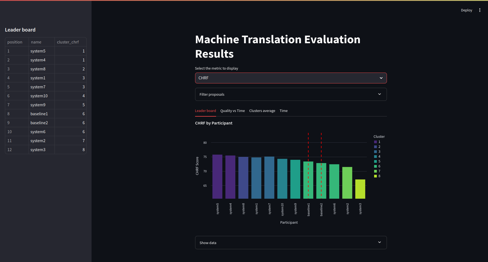

# DEEP: Docker-based Evaluation and Execution Platform

This repository contains a pipeline for automated execution of systems and evaluation of Machine Translation (MT), Optical Character Recognition (OCR) and Image Synthesis systems. After the evaluation, we also provide a visualization web-app to analyze the results.

Before using the software, it is important to  run the `setup.sh` script:
```bash
sh setup.sh
```
Otherwise, some functionalities won't work.

**Dependencies:**
- conda
- git
- java (BEER metric)

## Evaluation
The evaluation of the systems can be done using the `eval.py` script.

### Usage
```bash
python eval.py [reference ...] [options]
```

### Arguments
- `reference`: Path to the references file(s).

**Options:**
- `--source`: Path to the source files.
- `--systems`: Directory containing dockerized systems. If provided, systems will be run and evaluated.
- `--dir_preds`: Directory with the files containing translations.
- `--baselines`: List of baseline systems to evaluate.
- `--output`: File path to store the leaderboard.
- `-a`, `--append`: Append results to the output file.
- `--metrics`: List of metrics to use (default: BLEU and TER). Choices: `bleu`, `ter`, `chrf`, `wer`, `bwer`, `beer`, `fid`, `ssim`, `iou`.
- `--main_metric`: Main metric to sort the leaderboard (default: `bleu` for MT, `bwer` for DR).
- `--ascending`: Sort leaderboard in ascending order.
- `--trials`: Number of trials for ART (default: 10000).
- `--p_value`: P-value for ART (default: 0.05).
- `--task`: Task to evaluate (`mt`, `ocr`, `img`, `t_det`).
- `--subtask`: Subtask to evaluate.

Each system must be dockerized and prepared to be run appropriately. It must read the `data/source.sgm` file and write the corresponding translations in the `data/predictions.sgm` file of the docker container. The `eval.py` script will read the predictions, store them in a directory, evaluate each one with the specified metrics, and cluster the submissions.

The clustering algorithm is based on the significance of the difference in the metrics of the predictions. Once submissions are sorted by `main_metric`, the significance of differences between consecutive submissions is assessed. If not significant, those submissions will be part of the same cluster.

The results of the evaluation are stored in a `.csv` file with the specified name.

## Visualization
The visualization is performed using a Streamlit web app.

### Usage
```bash
streamlit run display.py <filename>
```
- `filename`: Path to the CSV file containing evaluation results.

## Demo
A demo/tutorial for the machine translation (MT) task is available in the `demo` folder. To launch the execution+evaluation process, navigate to the cloned repository directory and run:

```bash
python eval.py demo/test_set/newstestB2020-ende-ref.de.sgm \
    --source demo/test_set/newstestB2020-ende-src.en.sgm \
    --systems demo/proposals/ \
    --dir_preds demo/hypotheses/ \
    --output demo/results.csv \
    --metrics bleu ter chrf \
    --task mt \
    --subtask demo
```

We have also made available the hypotheses that the proposals should generate in case the user wants to avoid running the execution. You can execute just the evaluation by running the same command without the `--systems demo/proposals/` argument.

Even if you just want to try the visualization, the `results.csv` file is available. To execute the visualization tool, run:

```bash
streamlit run display.py demo/results.csv
```

Copy the corresponding URL to your favorite browser to view the results.

## Project Structure
- `metrics.py`: Functions for scoring hypotheses and running automated randomized tests for statistical significance.
- `eval.py`: Script that automates the execution and evaluation of NLP systems.
- `display.py`: Web-app script to analyze evaluation results.
- `setup.sh`: Script that installs dependencies.
- `demo.csv`: Example evaluation results.
- `requirements.txt`: Python dependencies.
- `demo/`: Resources for the demo/tutorial (dockerized systems, hypotheses, results, test sets).