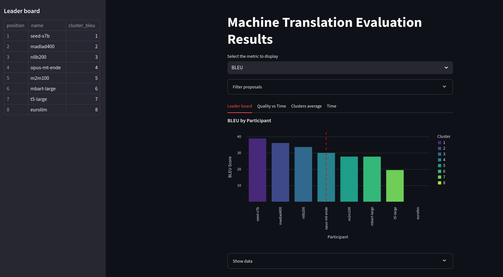

# DEEP: Docker-based Evaluation and Execution Platform

This git contains a pipeline for automated execution of systems and evaluation of Machine Translation (MT) and Handwriten Text Recognition (HTR) systems. After the evaluation we also provide a visualization web-app to analyse the results.

Before using the software it is important to run the `setup.sh` script:
```bash
sh setup.sh
```
Otherwise some functionalities won't work.

## Evaluation
The evaluation of the systems can be done using the `eval.py` script: 
```
usage: python eval.py [-h] [--source SOURCE [SOURCE ...]] [--systems SYSTEMS]
               [--dir_preds DIR_PREDS] [--baselines BASELINES [BASELINES ...]]
               [--output OUTPUT] [-a]
               [--metrics {bleu,ter,chrf,beer,wer,bwer} [{bleu,ter,chrf,beer,wer,bwer} ...]]
               [--trials TRIALS] [--p_value P_VALUE] --task {mt,dr} --subtask SUBTASK
               reference [reference ...]

Evaluates the participant dockerized models. They need to produce the hypotheses of the
source file in the same format as the reference(s) file(s).

positional arguments:
  reference             Path to the references file(s)

options:
  -h, --help            show this help message and exit
  --source SOURCE [SOURCE ...]
                        Path to the sources files
  --systems SYSTEMS     Path to the directory that contains all the dockerized systems.
                        If provided, the systems will be run and the translations will
                        be evaluated. If not provided, the translations will be read
                        from the dir_preds directory.
  --dir_preds DIR_PREDS
                        Name of directory with the translation files
  --baselines BASELINES [BASELINES ...]
                        List of baseline systems to be evaluated. Must be included among
                        the rest of the systems
  --output OUTPUT       Path to the file that will store the leaderboard
  -a, --append          Append the results to the output file
  --metrics {bleu,ter,chrf,beer,wer,bwer} [{bleu,ter,chrf,beer,wer,bwer} ...]
                        List of metrics to be used (default: BLEU and TER)
  --trials TRIALS       Number of trials for the ART (default: 10000)
  --p_value P_VALUE     P-value for the ART (default: 0.05)
  --task {mt,dr}        Task to be evaluated: mt (machine translation) or dr (document
                        recognition)
  --subtask SUBTASK     Subtask to be evaluated

```
Each system must be dockerized and prepared to be runned appropiately. It must read the `data/source.sgm` file and write the corresponding translations in the `data/predictions.sgm` file of the docker container. The `eval.py` script will read the predictions, store them in a directory, evaluate each one with the specified metrics and clusterize the submissions. 

The clusterization algorithm is based in the significance of the difference in the metrics of the predictions. Thus, once the submissions are sorted by BLEU the significance of the differences between consecutive submissions are assesed. If they are not significant enough those submissions will be part of the same cluster.

The results of the evaluation are stored in a `.csv` file with the specified name.

## Visualization
The visualization is performed using a Streamlit web app. This is the command to launch it:
```bash
streamlit run [OPTIONS] display.py <evaluation_file.csv> [mt|dr]
```
### Demo
A demo of the visualization can be launched with the command:
```bash
streamlit run display.py demo.csv mt
```

## Git guide
- `metrics.py`: contains the functions needed for scoring the hypotheses and runing automated randomized tests to check the statistical significance.
- `eval.py`: script that automates the execution and evaluation of NLP systems.
- `display.py`: script that contains the web-app to analyse the results of the evaluation.
- `setup.sh`: script that installs all the dependencies to execute the rest of functions of the application.
- `demo.csv`: file that contains the results of an example evaluation.
- `requirements.txt`: contains the python dependencies to execute the different parts of the pipeline.